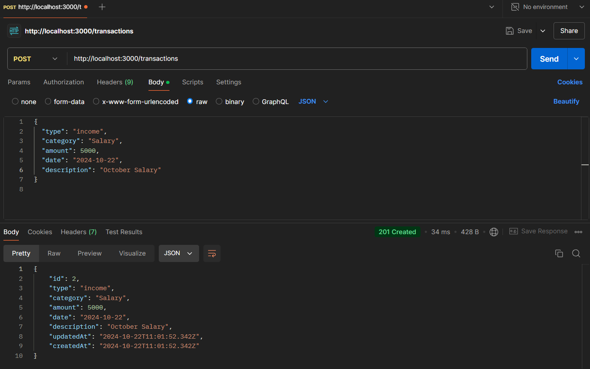
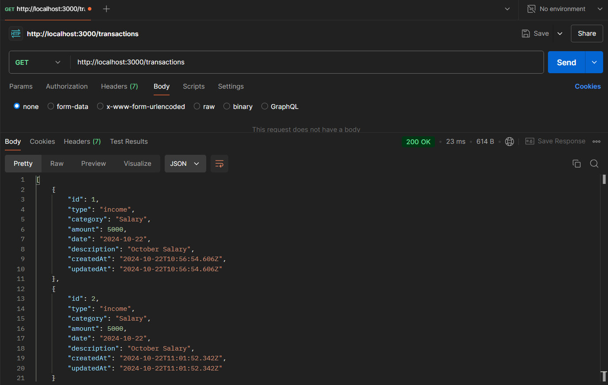
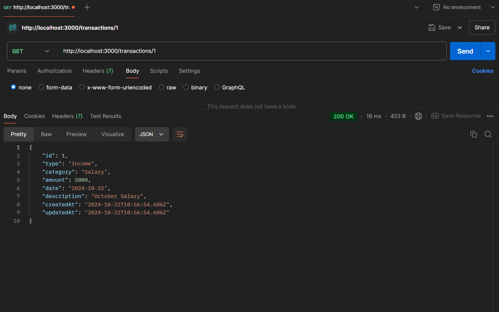
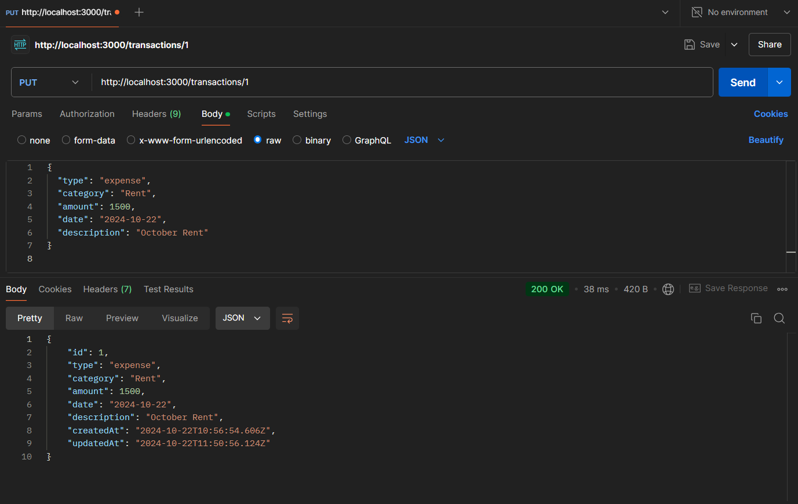
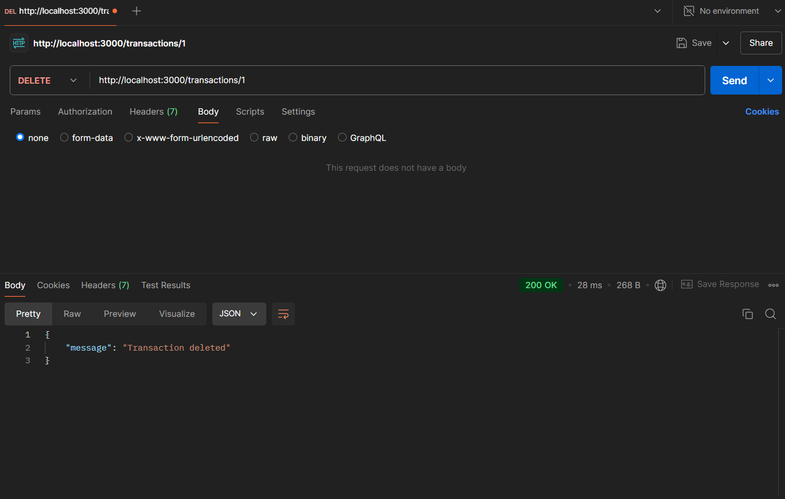

# Personal Expense Tracker API Documentation

### Table of Contents

1. Overview
2. Setup Instructions
3. API Endpoints
    - POST /transactions
    - GET /transactions
    - GET /transactions/
    - PUT /transactions/
    - DELETE /transactions/
    - GET /summary
4. Database Schema
5. Usage
   
### 1. Overview

This is a simple RESTful API built using **Node.js** and **Express.js** to manage personal income and expenses. The database used is **SQLite**, and the API allows you to create, retrieve, update, and delete transactions.

### 2. Setup Instructions

1. **Clone the repository:**

    ```
    git clone https://github.com/SudarshanaRao/Personal-Expense-Tracker.git
    cd personal-expense-tracker
    ```

2. **Install dependencies:**

    `npm install`

3. **Run the server:**

    `npm start`

4. Your server should be running on [Localhost](http://localhost:3000).

## 3. API Endpoints

### POST /transactions

**Description:** Adds a new transaction (income or expense).

  - **URL:** /transactions
  - **Method:** POST
  - **Request Body:**
    
      ```
      {
        "type": "income",
        "category": "Salary",
        "amount": 5000,
        "date": "2024-10-22",
        "description": "October Salary"
      }
      ```
  - **Response:** 201 Created
    
      ```
      {
        "id": 1,
        "type": "income",
        "category": "Salary",
        "amount": 5000,
        "date": "2024-10-22",
        "description": "October Salary"
      }
      ```
      
### GET /transactions

**Description:** Retrieves all transactions.

  - **URL:** /transactions
  - **Method:** GET
  - **Response:** 200 OK
    
      ```
      [
        {
          "id": 1,
          "type": "income",
          "category": "Salary",
          "amount": 5000,
          "date": "2024-10-22",
          "description": "October Salary"
        },
        {
          "id": 2,
          "type": "expense",
          "category": "Rent",
          "amount": 1500,
          "date": "2024-10-22",
          "description": "October Rent"
        }
      ]
      ```
      
### GET /transactions/

**Description:** Retrieves a specific transaction by ID.

  - **URL:** /transactions/:id
  - **Method:** GET
  - **Response:** 200 OK
    
      ```
      {
        "id": 1,
        "type": "income",
        "category": "Salary",
        "amount": 5000,
        "date": "2024-10-22",
        "description": "October Salary"
      }
      ```
      
### PUT /transactions/

**Description:** Updates a specific transaction by ID.

  - **URL:** /transactions/:id
  - **Method:** PUT
  - **Request Body:**
    
      ```
      {
        "type": "expense",
        "category": "Rent",
        "amount": 1500,
        "date": "2024-10-22",
        "description": "October Rent"
      }
      ```
      
  - **Response:** 200 OK
    
      ```
      {
        "id": 1,
        "type": "expense",
        "category": "Rent",
        "amount": 1500,
        "date": "2024-10-22",
        "description": "October Rent"
      }
      ```
      
### DELETE /transactions/

**Description:** Deletes a specific transaction by ID.

  - **URL:** /transactions/:id
  - **Method:** DELETE
  - **Response:** 200 OK
    
      ```
      {
        "message": "Transaction deleted successfully"
      }
      ```
      
### GET /summary

**Description:** Retrieves a summary of transactions, such as total income, total expenses, and balance.

  - **URL:** /summary
  - **Method:** GET
  - **Query Parameters (Optional):**

    - `from:` The start date for the summary.
    - `to:` The end date for the summary.
    - `category:` Filter by category (optional).

  - **Response:** 200 OK

      ```
      {
        "totalIncome": 10000,
        "totalExpenses": 5000,
        "balance": 5000
      }
      ```
      
## 4. Database Schema (SQLite)

### Transactions Table:

      
      CREATE TABLE transactions (
          id INTEGER PRIMARY KEY AUTOINCREMENT,
          type TEXT NOT NULL CHECK(type IN ('income', 'expense')),
          category TEXT NOT NULL,
          amount REAL NOT NULL,
          date TEXT NOT NULL,
          description TEXT
      );
      
      
### Categories Table:

      
      CREATE TABLE categories (
          id INTEGER PRIMARY KEY AUTOINCREMENT,
          name TEXT NOT NULL,
          type TEXT NOT NULL CHECK(type IN ('income', 'expense'))
      );
      
      
## 5. Usage

- Use **Postman** to test the API.
- Here are the Screenshot outputs using **Postman**

## 6. Screenshots

### POST /transactions

**Description:** Add a new transaction (income or expense).



### GET /transactions

**Description:** Retrieves all transactions.



### GET /transactions/:id

**Description:** Retrieves a specific transaction by ID.



### PUT /transactions/

**Description:** Updates a specific transaction by ID.



### DELETE /transactions/

**Description:** Deletes a specific transaction by ID.




